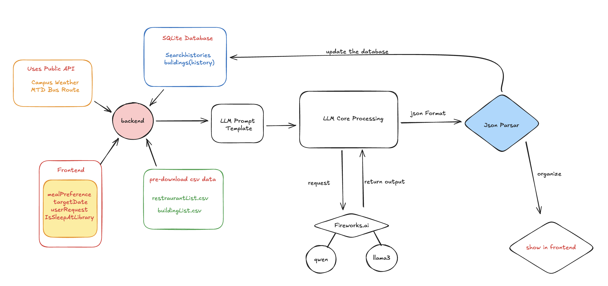
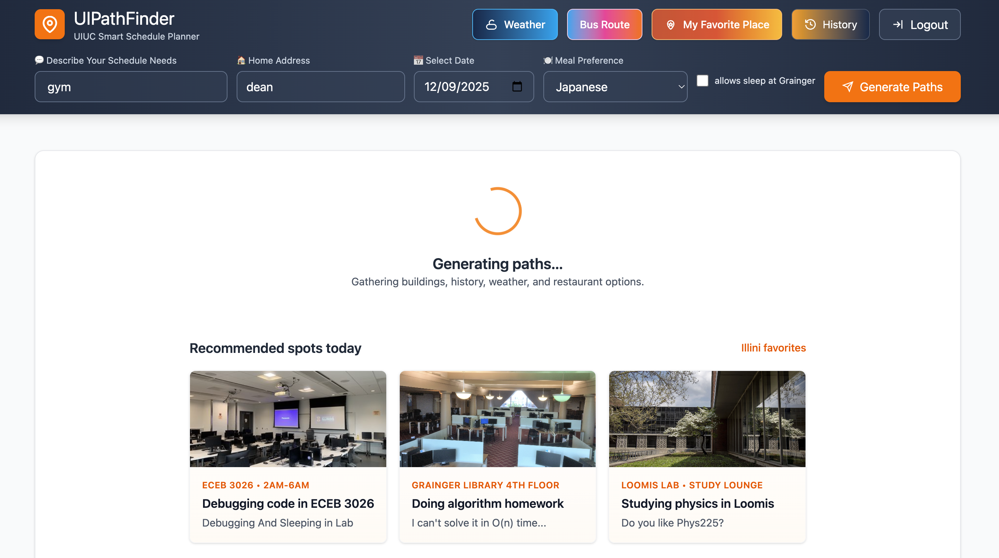
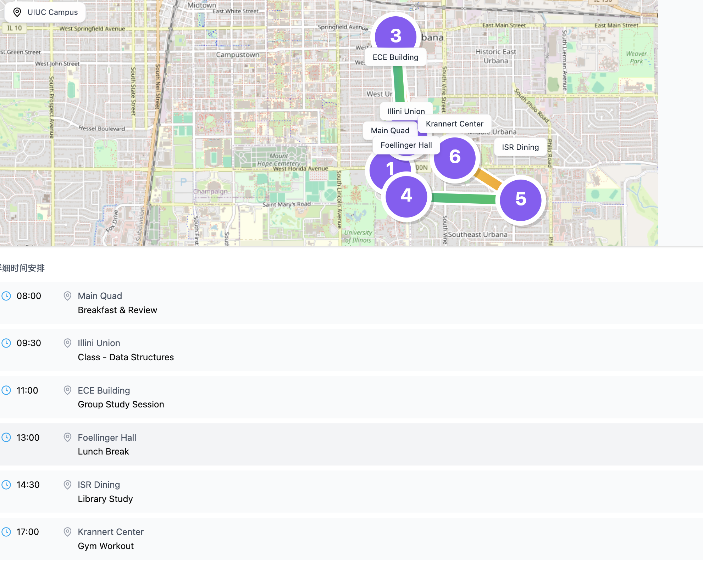

# UIPathFinder – UIUC Smart Schedule & Path Planner

> "Big Brother is Watching You" -- 1984

UIPathFinder helps UIUC students plan a full day on campus: describe your needs, and the app generates multiple path options with time-stamped stops, lunch/dinner picks, weather context, and maps—everything persisted in SQLite.

## What’s included (final build)
- Auth0 SPA login (env-driven) with guest fallback on backend.
- Planner inputs: free-text needs, date, home address, meal preference, “allow sleep at Grainger.”
- LLM plans (Fireworks Qwen3 VL 30B A3B + Llama v3.3 70B) enforce: start/end at home (unless sleep at library), ≥5 stops, lunch/dinner from the restaurant list; missing coords are backfilled so **all stops plot**.
- Maps: Leaflet shows every stop; straight-line routes between consecutive stops to avoid missing points; markers colored by academic/other. Weather modal is layered above the map.
- Favorites: 50+ campus locations from `database/uiuc_with_images.csv`; per-card fallback pool; visit counts seeded/randomized and persisted in `building_usage` (SQLite); select/restore increments usage.
- History: Reads from SQLite (Auth0 token optional); restore removes “Select” CTA and repopulates planner.
- Restaurants: `database/UIUC_Restaurants.csv` feeds lunch/dinner + meal preference to the LLM.
- Weather: NWS modal (Champaign/KCMI), °F/°C toggle, “open full forecast” button.
- Header quick links: Bus route (mtd.org) and weather.
- Loading UX: Spinner plus three recommended spots; overlay keeps prior results visible.
- Data resilience: coordinate backfill per stop; per-card image fallbacks; Alma Mater/photo pool avoids broken images.

## Architecture (frontend ↔ backend)

- **Frontend:** React/Vite + Auth0 SPA SDK + Leaflet; planner, maps, history, favorites, weather modal.
- **Backend:** Express + SQLite + Fireworks.ai; endpoints for histories, building-usage, schedules; OSRM fetcher retained (map uses straight lines for completeness).
- **LLM layer:** `LLM/llmama.js` builds prompt (home/meal/weather/history/buildings/restaurants); `backend/index.js` calls Fireworks, enforces JSON contract, backfills coords, applies fallbacks.

## Tech stack
- Frontend: React 18 + TypeScript, Vite, React Router, Leaflet, Auth0 SPA SDK.
- Backend: Node/Express, SQLite (`DB_PATH` or `backend/data.sqlite`), Fireworks.ai (via `openai` client).
- Styling: Utility-first classes, custom components.

## Key screens




## Favorites & images

- Source: `database/uiuc_with_images.csv`; per-card hashed fallback pool (Alma Mater + campus photos).
- Usage: `building_usage` seeds Grainger/Main Quad higher; select/restore increments counts to keep favorites fresh.

## Frontend structure
- `src/main.tsx` – mounts app with `Auth0Provider` + router.
- `src/App.tsx` – routes (`/` planner/login, `/history`, `/favorites`).
- `src/components/Header.tsx` – inputs, weather modal, quick links.
- `src/components/EnhancedPathSuggestions.tsx` – path cards, timelines, maps.
- `src/components/RouteMap.tsx` – plots all stops; straight lines.
- `src/components/LocationListPage.tsx` – favorites grid with usage + image fallbacks.
- `src/components/SearchHistoryPage.tsx` – history list/restore.
- `src/components/RecommendedSpots.tsx` – loading recommendations.

## Backend structure
- `backend/index.js` – Express API, Auth0 optional (guest), `/api/llm-schedules`, `/api/fireworks-test`, histories, building-usage, OSRM fetcher.
- `backend/db.js` – SQLite schema/helpers (users, histories, building_usage, restaurants).
- `database` – restaurants CSV, building images CSV.
- `LLM/llmama.js` – prompt builder with home/meal/weather/history/buildings/restaurants.

## Environment
Frontend (`frontend/.env` or host env):
```
VITE_AUTH0_DOMAIN=dev-x8hz2rfhh8u1hpwz.us.auth0.com
VITE_AUTH0_CLIENT_ID=<your SPA client id>
VITE_AUTH0_AUDIENCE=urn:uipathfinder-api
VITE_API_BASE=http://localhost:3001/api   # or deployed backend
```
Backend (`backend/.env`):
```
AUTH0_DOMAIN=dev-x8hz2rfhh8u1hpwz.us.auth0.com
AUTH0_AUDIENCE=urn:uipathfinder-api
FIREWORKS_API_KEY=...
PORT=3001
DB_PATH=./data.sqlite    # or /data/data.sqlite with a Render Disk
```

## Running locally
- Backend: `cd backend && npm install && node index.js`
- Frontend: `cd frontend && npm install && npm run dev` (build outputs to `build/`; set publish dir accordingly)

## LLM contract (current)
- Context: user profile/history, buildings, weather (Open-Meteo), restaurants CSV, meal preference, home address, sleep-at-library flag, transit guidance.
- Rules: start/end at home (unless sleep at library), ≥5 stops, include lunch & dinner, realistic timing.
- Output: `GOOD RESULT`/`LACK INFO` + JSON `pathResult` + `reason`; backend enforces/fallbacks, truncates reason, backfills coordinates, attaches optional OSRM segments.
